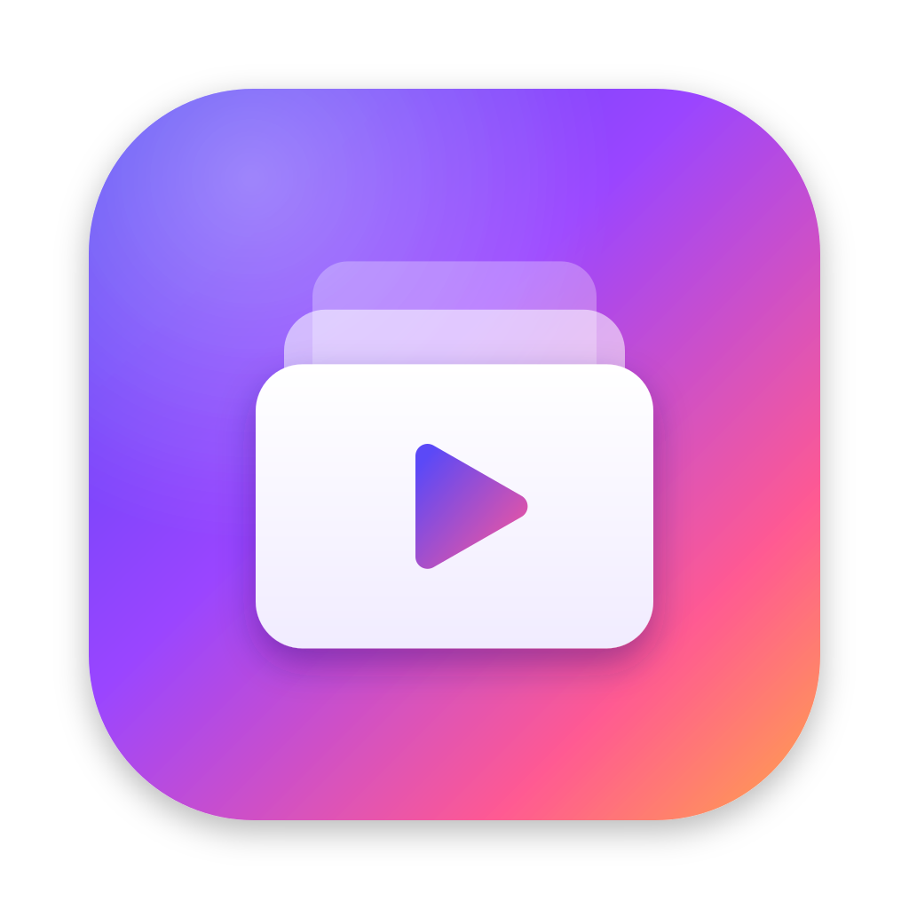
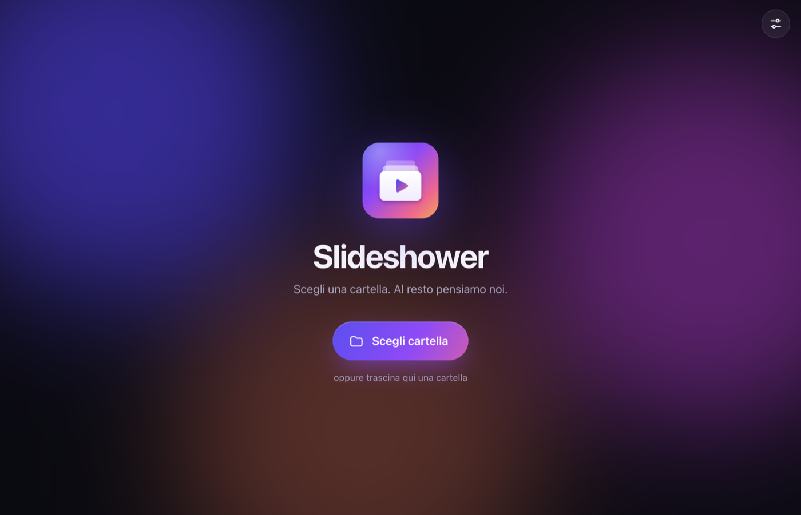
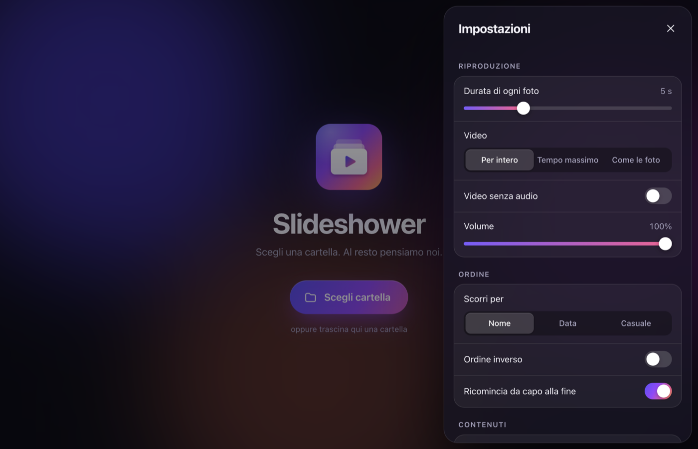

<div align="center">



# Slideshower

**Scegli una cartella. Al resto pensiamo noi.**

Presentazioni automatiche di foto e video, fluide e personalizzabili,
per **Mac**, **Windows** e **Android** — e anche direttamente nel browser.

[](https://github.com/carellice/slideshower/releases/latest)
[](https://github.com/carellice/slideshower/releases/latest)
[](https://carellice.github.io/slideshower/)



</div>

## Download

I collegamenti puntano sempre all'ultima versione pubblicata.

| Sistema | Download | Note |
|---|---|---|
| 🍎 **Mac** (Apple Silicon: M1, M2, M3…) | [**Slideshower-mac-arm64.dmg**](https://github.com/carellice/slideshower/releases/latest/download/Slideshower-mac-arm64.dmg) | macOS 12 o successivo |
| 🍎 **Mac** (Intel) | [**Slideshower-mac-x64.dmg**](https://github.com/carellice/slideshower/releases/latest/download/Slideshower-mac-x64.dmg) | macOS 12 o successivo |
| 🪟 **Windows** (64 bit) | [**Slideshower-windows.zip**](https://github.com/carellice/slideshower/releases/latest/download/Slideshower-windows.zip) | Windows 10 o 11 |
| 🤖 **Android** | [**Slideshower-android.apk**](https://github.com/carellice/slideshower/releases/latest/download/Slideshower-android.apk) | Android 7 o successivo |
| 🌐 **Web app** | [**carellice.github.io/slideshower**](https://carellice.github.io/slideshower/) | nessuna installazione |

Tutte le versioni: [pagina delle release](https://github.com/carellice/slideshower/releases/latest).

### Come si installa

<details>
<summary><b>Mac</b></summary>

1. Apri il file `.dmg` e trascina **Slideshower** nella cartella **Applicazioni**.
2. Al primo avvio macOS potrebbe bloccare l'app perché non è firmata con un certificato Apple.
   Vai in **Impostazioni di Sistema → Privacy e sicurezza** e premi **Apri comunque**, oppure esegui nel Terminale:

   ```bash
   xattr -cr /Applications/Slideshower.app
   ```
</details>

<details>
<summary><b>Windows</b></summary>

1. Estrai lo zip in una cartella a tua scelta (per esempio `Documenti\Slideshower`).
2. Avvia `Slideshower.exe`.
3. Se compare l'avviso di SmartScreen, premi **Ulteriori informazioni → Esegui comunque**.
</details>

<details>
<summary><b>Android</b></summary>

1. Scarica il file `.apk` sul telefono e aprilo.
2. Se richiesto, consenti l'installazione di app da questa origine.
</details>

<details>
<summary><b>Web app</b></summary>

Apri [carellice.github.io/slideshower](https://carellice.github.io/slideshower/) con un browser da computer (Chrome, Edge, Safari, Firefox) e scegli la cartella.
Le foto e i video **restano sul tuo dispositivo**: non viene caricato nulla in rete.
La versione web non ricorda le cartelle recenti e non converte le foto HEIC.
</details>

## Funzioni

- **Una cartella, tutto automatico** — scegli la cartella (o trascinala nella finestra su Mac e PC) e la presentazione parte. Le ultime cartelle restano tra i *Recenti*.
- **Foto e video insieme** — durata di ogni foto da 1 secondo a 10 minuti; i video possono andare per intero, avere un tempo massimo oppure durare quanto le foto.
- **Ordine** — per nome, per data o casuale, anche al contrario. Alla fine ricomincia da capo oppure si ferma, e in ordine casuale può rimescolare a ogni giro.
- **12 transizioni** — dissolvenza, scorrimento, verticale, zoom, sfocatura, copertura, capovolgi, cubo 3D, tendina, cerchio, nessuna e casuale, con durata regolabile e anteprima animata.
- **Aspetto** — foto intera con sfondo sfocato o nero, oppure a tutto schermo; movimento lento sulle foto (effetto Ken Burns); barra di avanzamento, contatore, nome del file e orologio a scelta.
- **Contenuti** — solo foto, solo video o entrambi; sottocartelle incluse o escluse.
- **Comodità** — schermo intero, schermo sempre acceso, audio e volume dei video, riapertura dell'ultima cartella all'avvio.
- **Introduzione al primo avvio** — una breve guida spiega come funziona l'app; puoi rivederla quando vuoi da *Impostazioni → Aiuto*.
- **Aggiornamenti integrati** — l'app controlla da sola se esiste una versione più recente e la scarica dalle impostazioni.

Ogni modifica alle impostazioni si applica subito, anche mentre la presentazione scorre.

<div align="center">

</div>

### Formati supportati

| | Formati |
|---|---|
| Foto | JPG, PNG, GIF, WebP, AVIF, BMP, SVG — e **HEIC** su Mac |
| Video | MP4, MOV, M4V, WebM, MKV, OGV, 3GP (secondo i codec disponibili sul dispositivo) |

### Comandi

| Tasto (Mac e PC) | Azione |
|---|---|
| <kbd>Spazio</kbd> | Pausa / riprendi |
| <kbd>←</kbd> <kbd>→</kbd> | Precedente / successivo |
| <kbd>F</kbd> | Schermo intero |
| <kbd>R</kbd> | Ordine casuale |
| <kbd>L</kbd> | Ripetizione |
| <kbd>M</kbd> | Audio |
| <kbd>S</kbd> | Impostazioni |
| <kbd>Esc</kbd> | Esci dalla presentazione |

Su Android: **scorri** a destra o sinistra per cambiare, **tocca** per mostrare i comandi.

## Aggiornamenti

In **Impostazioni → Aggiornamenti** trovi la versione installata e il pulsante **Controlla**.
Se esiste una versione più recente compare **Scarica e installa** (e un puntino sull'icona delle impostazioni):

- **Mac** — scarica il `.dmg` nella cartella Download e lo apre: trascina l'app in Applicazioni sostituendo la precedente.
- **Windows** — scarica lo zip nella cartella Download: estrailo sopra la versione precedente.
- **Android** — scarica l'`.apk` e apre l'installazione di sistema.

## Per chi sviluppa

L'interfaccia è un'unica app web (cartella [`app/`](app)), senza framework e senza passaggi di compilazione.
Viene incapsulata con [Electron](https://www.electronjs.org/) su Mac e Windows e con [Capacitor](https://capacitorjs.com/) su Android, dove un piccolo plugin nativo gestisce la scelta della cartella e gli aggiornamenti.

```
app/        interfaccia condivisa (HTML, CSS, JavaScript)
desktop/    processo principale Electron (finestra, scansione cartelle, download aggiornamenti)
android/    progetto Android con il plugin nativo
build/      icone generate
scripts/    generatore delle icone
```

Servono [Node.js](https://nodejs.org/) 20+ e, per Android, Android Studio.

```bash
npm install
```

```bash
npm start
```

| Comando | Risultato |
|---|---|
| `npm start` | avvia l'app desktop in sviluppo |
| `npm run dist:mac` | crea i `.dmg` per Mac in `dist/` |
| `npm run dist:win` | crea lo zip per Windows in `dist/` |
| `npm run android:apk` | crea l'`.apk` Android in `dist/` |
| `npm run icons` | rigenera tutte le icone da `scripts/make-icons.mjs` |

### Pubblicare una nuova versione

Su Mac basta un doppio clic su [`rilascia.command`](rilascia.command). Lo script:

1. chiede il numero della nuova versione;
2. compila i pacchetti per Mac (Apple Silicon e Intel), Windows e Android;
3. salva il codice su GitHub, il che aggiorna anche la web app su GitHub Pages;
4. **cancella le release precedenti** e pubblica quella nuova con i quattro pacchetti.

Richiede la [GitHub CLI](https://cli.github.com/) con l'accesso già effettuato (`gh auth login`).
